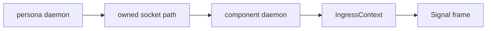
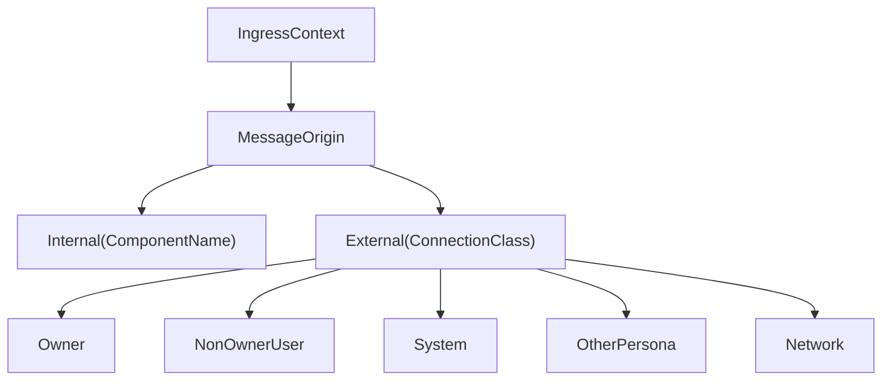

# signal-persona-auth — architecture

*Persona contract crate for origin context. Where a request entered
the Persona engine and which known route / channel labels are
attached to that ingress.*

This crate is deliberately not an authentication library.

## 0 · TL;DR

`signal-persona-auth` defines typed provenance records for Persona
ingress: who is allowed to assert what, where the request entered the
engine, and what known route/channel identifiers are attached. No
in-band auth proof, no Persona-specific signing material.

The crate is types-only: there is no `signal_channel!` declaration
because no relation crosses a Signal wire whose vocabulary is
provenance alone. Other contract crates (`signal-persona-message`,
`signal-persona`, etc.) import the typed records and attach them to
their own request/reply payloads.

Boundary trust lives outside this crate: the Persona daemon creates
per-engine sockets with the right ownership and permissions; the
components accept connections on their own sockets; after the
connection has crossed that local trust boundary, the component
attaches typed origin context to internal Signal frames.

## 1 · Owned surface

- `EngineId`, `RouteId`, `ChannelId` — typed engine, route, and
  channel identifiers used by the daemon/router boundary. Not
  security tokens.
- `ComponentName` — closed enum of supervised local Persona
  component principals.
- `ConnectionClass` — closed enum of known ingress classes.
- `OwnerIdentity` — engine ownership recorded from local system
  context.
- `MessageOrigin` — closed enum naming `Internal(ComponentName)` or
  `External(ConnectionClass)`.
- `IngressContext` — typed bundle of origin facts attached to a
  Signal frame.

## 2 · Boundary



The Persona daemon creates per-engine sockets with the right
ownership and permissions. Components accept connections on their
own sockets. After a connection has crossed that local trust
boundary, the component can attach typed origin context to internal
Signal frames.

## 3 · Types



`EngineId`, `RouteId`, and `ChannelId` identify the engine, route,
and channel vocabulary used by the daemon/router boundary. They are
not security tokens.

## 4 · SO_PEERCRED → ConnectionClass mapping

The mapping from kernel-supplied peer credentials to
`ConnectionClass` is fixed:

```text
On message.sock (the only user-writable socket in the engine):
  SO_PEERCRED.uid == engine_owner_uid       →  ConnectionClass::Owner
  SO_PEERCRED.uid != engine_owner_uid       →  ConnectionClass::NonOwnerUser(Uid)

On internal sockets (mode 0600 — only persona-user processes can
connect; the kernel rejects other uids before the accept loop runs):
  SO_PEERCRED.uid == persona_system_uid     →  Internal(component_name from the spawn envelope)
```

The `engine_owner_uid` comes from the manager catalog
(`OwnerIdentity::User(Uid)`). The `persona_system_uid` is the
deployment's `persona` system user. The mapping is contract-stable;
implementations cannot reinterpret SO_PEERCRED values into other
`ConnectionClass` variants without a coordinated wire bump.

## 5 · Constraints

| Constraint | Witness |
|---|---|
| This crate defines typed provenance records for Persona ingress. | Source review in `src/lib.rs`. |
| This crate does not define a Persona-specific in-band proof type. | Source-scan witness in `tests/round_trip.rs` rejects an `AuthProof` symbol. |
| This crate has no daemon, socket, actor, terminal, or database logic. | Source scan: no Kameo, Tokio, socket, redb, or terminal-cell code. |
| `ConnectionClass` is a closed enum for known ingress classes. | Exhaustive-match round-trip witness. |
| `ComponentName` is a closed enum for supervised local Persona component principals. | Exhaustive-match round-trip witness. |
| `OwnerIdentity` records engine ownership from local system context. | Round-trip witness on every variant. |
| `IngressContext` carries origin context, not proof material. | Source review + `AuthProof` symbol-absence witness. |
| Wire enums contain no `Unknown` variant. | Source scan: `ConnectionClass`, `ComponentName`, `MessageOrigin` are exhaustively matched in `tests/round_trip.rs`; adding an `Unknown` variant breaks the match. |
| Any record name containing the word `Unknown` represents a positive "entity not in our state" rejection, not a polling-shape escape hatch. | This crate has no such records. |
| Round-trip witnesses cover every variant in rkyv. | `tests/round_trip.rs` exercises every identifier, component name, owner identity, connection class, message origin, and ingress context shape. |
| Round-trip witnesses cover every variant in NOTA. | `examples/canonical.nota` holds canonical text examples for every record kind; round-trip tests parse and re-emit each. |
| Public constructors attach behavior to the data they create. | Source review: typed newtypes carry methods, not free helpers. |
| String-backed identifiers are private-field newtypes with explicit text projections. | Source review: `EngineId`, `RouteId`, `ChannelId` are `NotaTransparent` newtypes with private fields. |
| Contract crate dependencies use a named API reference (branch or tag), not a raw revision pin. | `Cargo.toml` review: dependencies declare `git = "..."` with a named-branch shape; raw `rev = "..."` pins are not used. |

## 6 · NOTA codec note

This crate has no `signal_channel!` declaration; there is no payload-
head-vs-variant-name distinction here. Records derive `NotaRecord`,
`NotaEnum`, or `NotaTransparent` directly; the text head matches the
type name.

## 7 · Versioning

This crate is type-only vocabulary. Schema-level changes are
breaking; coordinate every contract crate that imports
`IngressContext`, `OwnerIdentity`, etc.

This crate depends on `signal-core` via a named-branch reference,
not a raw revision pin. The destination is a stable `signal-core` API
branch/bookmark once that lane is declared.

## 8 · Non-goals

- No in-band signing.
- No runtime permission checks.
- No component socket ownership.
- No routing policy.
- No storage.
- No compatibility wrapper for legacy lock files.

## 9 · Code map

```text
src/
└── lib.rs                — typed identifiers, closed enums, ingress records
examples/
└── canonical.nota         — one canonical example per record kind
tests/
└── round_trip.rs          — per-record rkyv + NOTA witnesses, AuthProof absence
```

## See also

- `signal-persona/ARCHITECTURE.md` — engine-manager contract that
  imports `OwnerIdentity` for the `SpawnEnvelope`.
- `signal-persona-message/ARCHITECTURE.md` — message ingress contract
  that imports `IngressContext` for SO_PEERCRED-derived origin tagging.
- `signal-core/ARCHITECTURE.md` — frame envelope kernel.
- `~/primary/skills/contract-repo.md` — contract-repo discipline.
