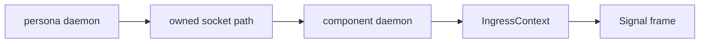
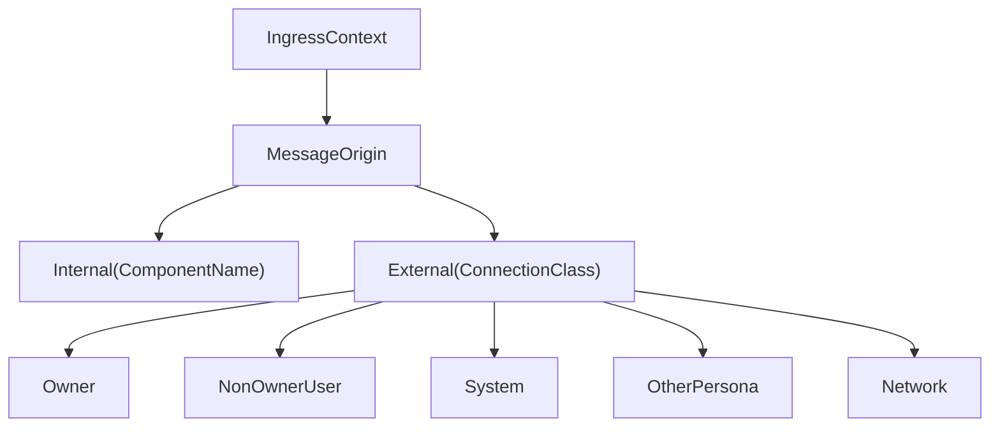

# signal-persona-auth Architecture

`signal-persona-auth` is the Persona contract crate for origin context.
It names where a request entered the Persona engine and which known
route/channel labels are attached to that ingress.

It is deliberately not an authentication library.

## Constraints

- The crate defines typed provenance records for Persona ingress.
- The crate does not define a Persona-specific in-band proof type.
- The crate has no daemon, socket, actor, terminal, or database logic.
- `ConnectionClass` is a closed enum for known ingress classes.
- `ComponentName` is a closed enum for known first-stack Persona
  components.
- `OwnerIdentity` records engine ownership from local system context.
- `IngressContext` carries origin context, not proof material.
- Records round-trip through `rkyv` and NOTA text where they cross readable
  surfaces.
- Public constructors attach behavior to the data they create.
- String-backed identifiers are private-field newtypes with explicit text
  projections.

## Boundary

Local trust is established before a frame is accepted:



The Persona daemon creates per-engine sockets with the right ownership
and permissions. Components accept connections on their own sockets.
After a connection has crossed that local trust boundary, the component
can attach typed origin context to internal Signal frames.

## Types



`EngineId`, `RouteId`, and `ChannelId` identify the engine, route, and
channel vocabulary used by the daemon/router boundary. They are not
security tokens.

## SO_PEERCRED → ConnectionClass mapping

Per `~/primary/reports/designer/144-prototype-architecture-final-cleanup-after-da36.md` §3.6,
the mapping from kernel-supplied peer credentials to
`ConnectionClass` is fixed:

```text
On message.sock (the only user-writable socket in the engine):
  SO_PEERCRED.uid == engine_owner_uid       →  ConnectionClass::Owner
  SO_PEERCRED.uid != engine_owner_uid       →  ConnectionClass::NonOwnerUser(Uid)

On internal sockets (mode 0600 — only persona-user
processes can connect; the kernel rejects other uids
before the accept loop runs):
  SO_PEERCRED.uid == persona_system_uid     →  Internal(component_name from the spawn envelope)
```

The `engine_owner_uid` comes from the manager catalog
(`OwnerIdentity::User(Uid)`). The `persona_system_uid` is the
deployment's `persona` system user. The mapping is contract-stable;
implementations cannot reinterpret SO_PEERCRED values into other
`ConnectionClass` variants without a coordinated wire bump.

## Round Trips

Tests in `tests/round_trip.rs` cover rkyv frame round trips for identifiers,
component names, owner identity, connection class, message origin, and ingress
context. NOTA text witnesses cover `EngineId` and `IngressContext`.

`IngressContext` is origin context. The source scan test rejects a
Persona-specific `AuthProof` type so proof/gate vocabulary does not re-enter
this contract.

## Non-Goals

- No in-band signing.
- No runtime permission checks.
- No component socket ownership.
- No routing policy.
- No storage.
- No compatibility wrapper for legacy lock files.
