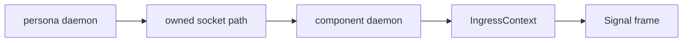
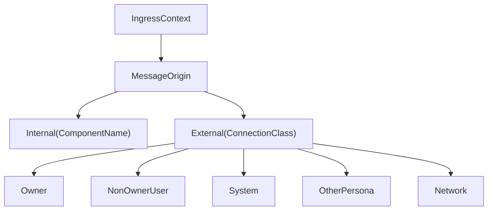

# signal-persona-auth Architecture

`signal-persona-auth` is the Persona contract crate for origin context.
It names where a request entered the Persona engine and which known
route/channel labels are attached to that ingress.

It is deliberately not an authentication library.

## Constraints

- The crate defines typed provenance records for Persona ingress.
- The crate does not define a Persona-specific `AuthProof`.
- The crate has no daemon, socket, actor, terminal, or database logic.
- `ConnectionClass` is a closed enum for known ingress classes.
- `ComponentName` is a closed enum for known first-stack Persona
  components.
- `IngressContext` carries origin context, not proof material.
- Records round-trip through `rkyv`.
- Public constructors attach behavior to the data they create.
- String-backed identifiers are private-field newtypes.

## Boundary

Local trust is established before a frame is accepted:

The Persona daemon creates per-engine sockets with the right ownership
and permissions. Components accept connections on their own sockets.
After a connection has crossed that local trust boundary, the component
can attach typed origin context to internal Signal frames.

## Types

`EngineId`, `RouteId`, and `ChannelId` identify the engine, route, and
channel vocabulary used by the daemon/router boundary. They are not
security tokens.

## Non-Goals

- No in-band signing.
- No runtime permission checks.
- No component socket ownership.
- No routing policy.
- No storage.
- No compatibility wrapper for legacy lock files.

